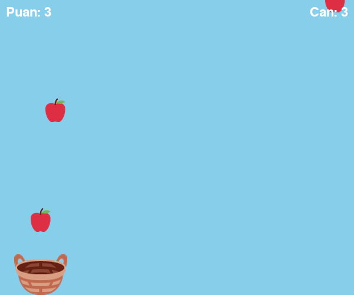
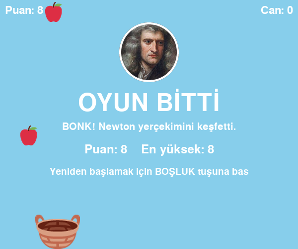

# Not Today, Newton 🍎

*Bugün olmaz, Newton!*

Newton bir elma ağacının altında oturuyor. Elmalardan biri kafasına düşerse yerçekimini keşfedecek.
Senin görevin, düşen elmaları sepetinle yakalayıp bu keşfi bir gün daha ertelemek.
Python ve [PyGame Zero](https://pygame-zero.readthedocs.io/) ile yazılmış küçük bir oyun.

Çocuklara Python'u oyun yaparak öğretmek için hazırladığım örnek bir proje:
kod kısa (tek dosya) ve her bölümü sade Türkçe açıklamalarla anlatılıyor.

<p>
  
  
</p>

## Nasıl oynanır?

- **← →** ok tuşlarıyla sepeti sağa sola götür.
- Yakaladığın her elma **1 puan**.
- **3 elma** kaçırırsan *BONK!* Newton yerçekimini keşfeder ve oyun biter. **BOŞLUK** tuşuyla yeniden başlarsın.
- Her 5 puanda elmalar biraz daha hızlı düşer. Yerçekimi şakaya gelmez.

## Çalıştırma

Python 3 ve PyGame Zero gerekir:

```bash
pip install pgzero
pgzrun oyun.py
```

Debian/Ubuntu'da `pip` yerine `sudo apt install python3-pgzero` da olur.

## Kodda neler var?

| Kavram | Oyunda nerede? |
|---|---|
| Değişken | `puan`, `canlar`, `oyun_bitti` oyunun o anki durumunu tutar |
| Liste | `elmalar`: yeni elma `append` ile eklenir, yakalanan ya da düşen `remove` ile çıkarılır |
| Döngü | `for elma in elmalar[:]` ekrandaki her elmayı tek tek aşağı indirir |
| Koşul | `if sepet.colliderect(elma)` elma sepete değdi mi? `elif elma.top > HEIGHT` yere mi düştü? |
| Fonksiyon | `yeni_elma` her saniye yeni bir elma yapar, `yeni_oyun` her şeyi sıfırlar |
| Actor (resimli nesne) | `Actor("elma")` resmini `images/elma.png` dosyasından alır, `elma.draw()` ile çizilir |

`draw`, `update` ve `on_key_down` fonksiyonlarını kodun içinde hiç çağırmıyoruz:
PyGame Zero bu isimleri bulur ve onları kendisi çağırır (`draw` ile `update` saniyede 60 kez,
`on_key_down` bir tuşa basıldığında).

## Kendin dene

1. `HIZ = 12` yap. Sepet nasıl değişti?
2. Elmanın resmini değiştir: kendi çizdiğin bir resmi `images/elma.png` adıyla kaydet ve oyunu yeniden çalıştır.
3. Arka planın rengini değiştir. İpucu: renkler (kırmızı, yeşil, mavi) karışımıdır; gece için `(20, 24, 60)` dene.
4. **Altın elma:** Bazen sarı bir elma düşsün ve yakalayınca 5 puan versin.
   İpucu: `yeni_elma` içinde `random.randint(1, 10) == 1` ise `Actor("altin_elma")` yap ve ayrı bir `altin_elmalar` listesine ekle.

## Lisans

Kod [MIT](LICENSE) lisanslı: kopyala, değiştir, derste kullan, kendi oyununa dönüştür.

Görseller kendi lisanslarıyla kullanıldı:

- **Elma ve sepet** (`images/elma.png`, `images/sepet.png`): [Twemoji](https://github.com/jdecked/twemoji),
  © Twitter, Inc. ve katkıda bulunanlar, [CC-BY 4.0](https://creativecommons.org/licenses/by/4.0/).
  Kırpılıp yeniden boyutlandırıldı.
- **Newton portresi** (`images/newton.png`): Godfrey Kneller, 1689,
  [Wikimedia Commons](https://commons.wikimedia.org/wiki/File:GodfreyKneller-IsaacNewton-1689.jpg), kamu malı.
  Yuvarlak kırpıldı.
